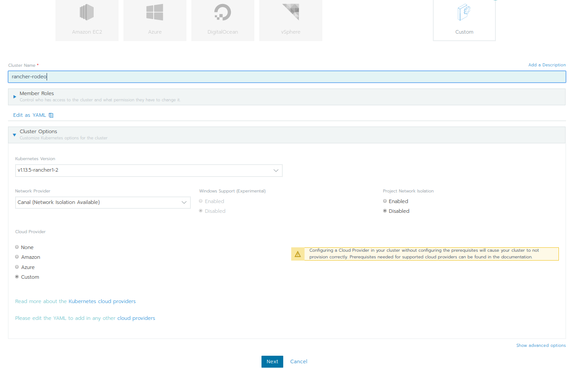
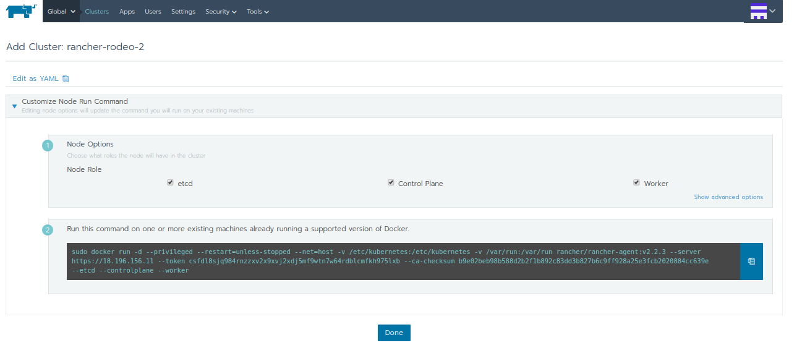
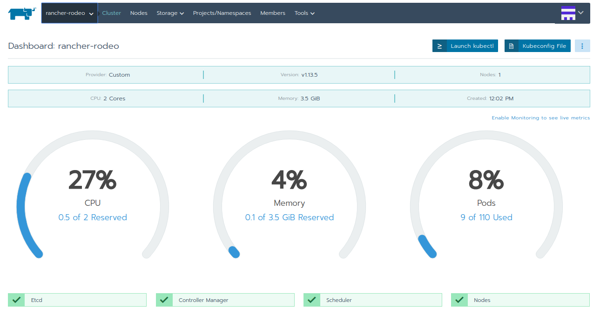
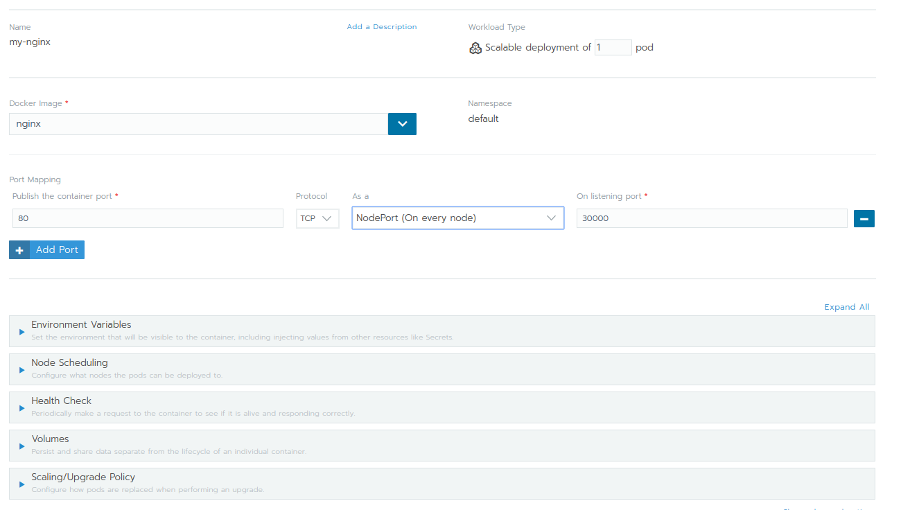
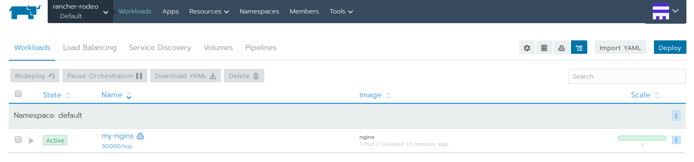
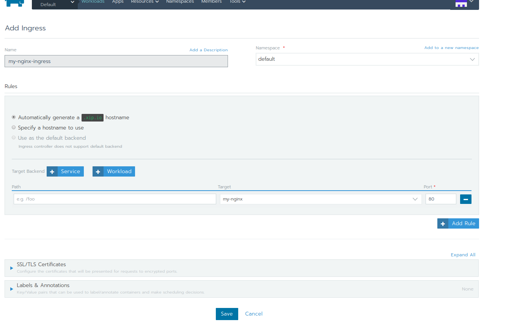

# Rancher Rodeo workshop Stuttgart, June 5th 2019

the terraform setup for AWS does not work (subnet issues), hence create an EC2 instance manually und use that one. Characteristics:
* CentOS AMI
* open ports 22,80,443 to be able to reach that instance
* install docker on that instance: ```sudo yum install -y docker```


## setup single-node Rancher server
launch EC2 instance in AWS and install docker on it.
...start docker container, containing the Rancher server, see [here](./guide/deploying-rancher-server.md)

open https://<rancher-server-ip>

## add cluster
since we started our single-node "cluster", we provision K8 itself via Rancher.  
- choose "add cluster" => "custom"
- provide a cluster name  
- choose K8s version you want to install
- choose Network Overlay you want to use
- click _Custom_ as cloud provider (since we have already provisioned our single-node "Infrastructure")

- click "Next"

- since we are using a single node cluster, enable all roles for that node !!
- in that sandbox environment we do not need to modify external-/internal-addresses, check for "real" deployments, e.g. the internal could be set to AWS internal IP
- execute the provided command on the node (the EC2 instance), to provision K8s there.

- click "Done"


After a short ramp-up time, your cluster will be shown in the Rancher dashboard:



you can also
* provision K8s on a public cloud infrastructure via Rancher
* provision Rancher in an already running K8s cluster

## Rancher "project"
is an abstract entity, not K8s related.  
It is used to enable multi-tenancy within a Rancher setup. Project permissions are based on the members of the project, but underlying separation is mainly based on namespaces. E.g. on cluster creation time, if you specify "custom"-cluster you can enable/disable "Project Network Isolation", which of course requires a network overlay type that supports this.

## deploy a workload
deploy example workload _nginx_  


* NodePort type, Mapping from port *80* to e.g. _random_ , or _30000_



now open browser and go to http://<your-instance-public-ip>:30000


## add ingress
to add an ingress service to the previously created nginx workload, go to "workload"=>"Load balancing"=>"add ingress"   



click _Launch_ to create the ingress

